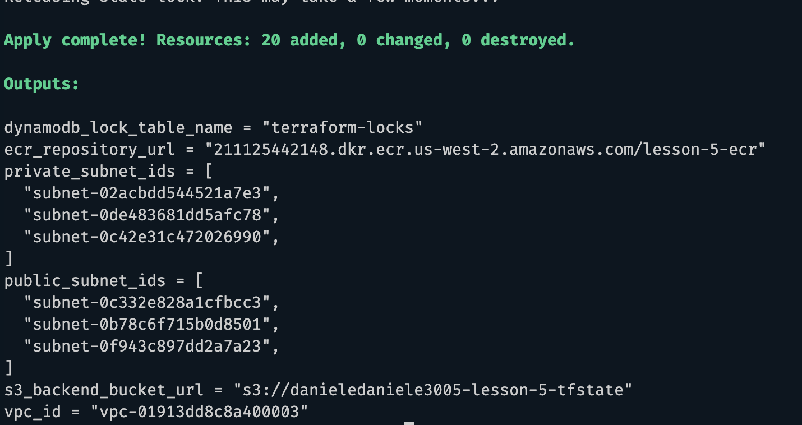
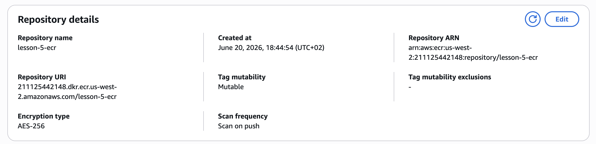
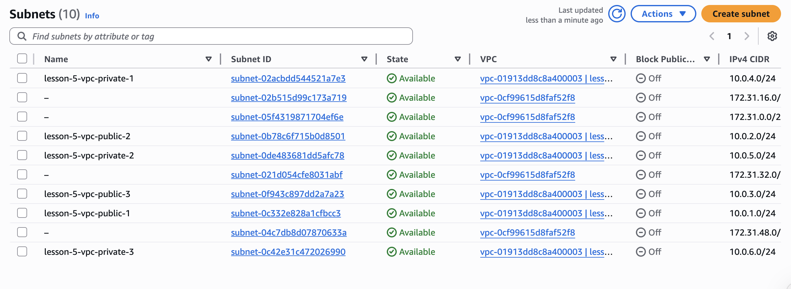

# Lesson 5 — Terraform AWS Infrastructure

## Опис

Проєкт реалізує інфраструктуру AWS за допомогою Terraform із використанням
модульного підходу.

У межах завдання налаштовано:

- Зберігання Terraform state у S3.
- Блокування state через DynamoDB.
- VPC з публічними та приватними підмережами.
- Internet Gateway та NAT Gateway.
- ECR репозиторій для Docker образів.

---

## Структура проєкту

```text
lesson-5/
├── main.tf
├── backend.tf
├── outputs.tf
│
├── modules/
│   ├── s3-backend/
│   │   ├── s3.tf
│   │   ├── dynamodb.tf
│   │   ├── variables.tf
│   │   └── outputs.tf
│   │
│   ├── vpc/
│   │   ├── vpc.tf
│   │   ├── routes.tf
│   │   ├── variables.tf
│   │   └── outputs.tf
│   │
│   └── ecr/
│       ├── ecr.tf
│       ├── variables.tf
│       └── outputs.tf
│
└── README.md
```

---

## Модулі

### s3-backend

Створює:

- S3 Bucket для Terraform State.
- Bucket Versioning.
- Server Side Encryption.
- Public Access Block.
- DynamoDB таблицю для блокування Terraform State.

### vpc

Створює:

- VPC (`10.0.0.0/16`)
- 3 Public Subnets
- 3 Private Subnets
- Internet Gateway
- NAT Gateway
- Route Tables
- Route Table Associations

### ecr

Створює:

- Amazon ECR Repository
- Image Scan on Push
- Repository Policy
- Output із URL репозиторію

---

## Terraform Backend

Для зберігання Terraform State використовується:

- Amazon S3
- Amazon DynamoDB

```hcl
terraform {
  backend "s3" {
    bucket         = "danieledaniele3005-lesson-5-tfstate"
    key            = "lesson-5/terraform.tfstate"
    region         = "us-west-2"
    dynamodb_table = "terraform-locks"
    encrypt        = true
  }
}
```

---

## Запуск проєкту

Ініціалізація:

```bash
terraform init
```

Перегляд плану:

```bash
terraform plan
```

Створення ресурсів:

```bash
terraform apply
```

Видалення ресурсів:

```bash
terraform destroy
```

---

## Результат виконання

### Terraform Apply

Успішне створення AWS інфраструктури.



### Amazon ECR Repository

Створений репозиторій Amazon ECR із автоматичним скануванням образів.



### VPC та Subnets

Створено:

- 3 Public Subnets
- 3 Private Subnets



---

## Outputs

Після виконання `terraform apply` виводяться:

- S3 Bucket URL
- DynamoDB Table Name
- VPC ID
- Public Subnet IDs
- Private Subnet IDs
- ECR Repository URL

---

## AWS Resources Created

- Amazon S3 Bucket
- Amazon DynamoDB Table
- Amazon VPC
- 3 Public Subnets
- 3 Private Subnets
- Internet Gateway
- NAT Gateway
- Route Tables
- Amazon ECR Repository
