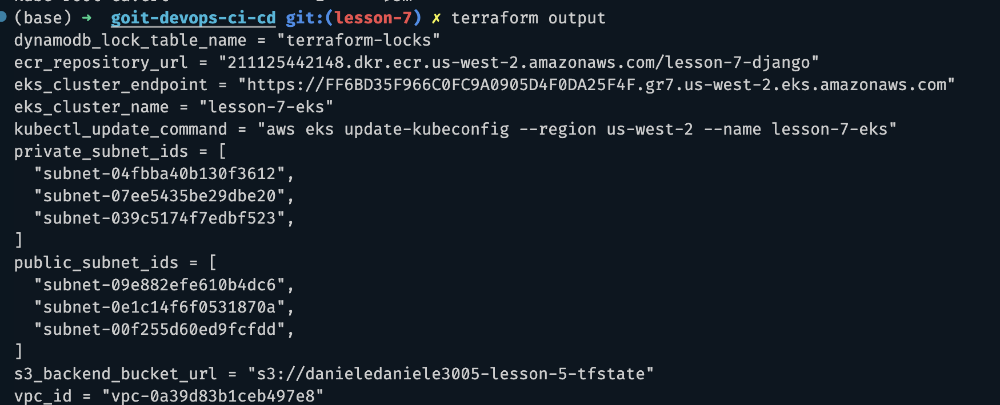
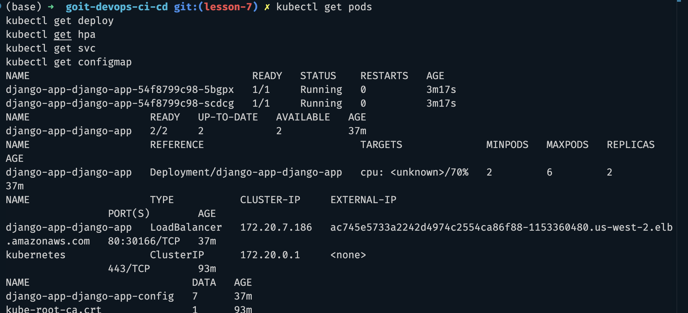

# Lesson 7 — Kubernetes (EKS) + Terraform + Helm

## Опис

У цьому проєкті за допомогою **Terraform** створено інфраструктуру в AWS:

- VPC
- Amazon EKS
- Amazon ECR
- S3 Backend для Terraform State
- DynamoDB для блокування Terraform State

Після цього Django-застосунок було завантажено в **Amazon ECR** та розгорнуто в
кластері **Kubernetes** за допомогою **Helm**.

---

# Структура проєкту

```text
lesson-7/
├── backend.tf
├── main.tf
├── outputs.tf
├── modules/
│   ├── eks/
│   ├── ecr/
│   ├── vpc/
│   └── s3-backend/
└── charts/
    └── django-app/
        ├── Chart.yaml
        ├── values.yaml
        └── templates/
            ├── deployment.yaml
            ├── service.yaml
            ├── configmap.yaml
            └── hpa.yaml
```

---

# Запуск проєкту

## Ініціалізація Terraform

```bash
terraform init
terraform plan
terraform apply
```

## Налаштування kubectl

```bash
aws eks update-kubeconfig --region us-west-2 --name lesson-7-eks
```

## Розгортання застосунку

```bash
helm install django-app ./charts/django-app
```

---

# Перевірка

Переглянути ресурси Kubernetes:

```bash
kubectl get pods
kubectl get deploy
kubectl get svc
kubectl get hpa
kubectl get configmap
```

---

# Реалізовано

- ✅ Amazon EKS
- ✅ Amazon ECR
- ✅ Helm Chart
- ✅ Deployment
- ✅ Service (LoadBalancer)
- ✅ ConfigMap
- ✅ Horizontal Pod Autoscaler
- ✅ Підключення ConfigMap через `envFrom`

---

# Скріншоти

## Terraform Apply

Успішне застосування Terraform-конфігурації та створення AWS-інфраструктури.


---

## Terraform Outputs

Виведення Terraform Outputs після створення інфраструктури.

Містить:

- `eks_cluster_name`
- `eks_cluster_endpoint`
- `ecr_repository_url`
- `public_subnet_ids`
- `private_subnet_ids`
- `kubectl_update_command`
- `s3_backend_bucket_url`



---

## Kubernetes Resources

Перевірка успішного розгортання застосунку за допомогою Helm.

На скріншоті видно:

- Running Pods;
- Deployment;
- Service типу **LoadBalancer**;
- ConfigMap;
- Horizontal Pod Autoscaler (HPA).


